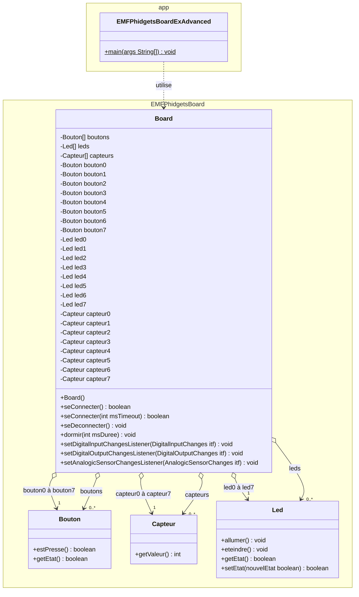
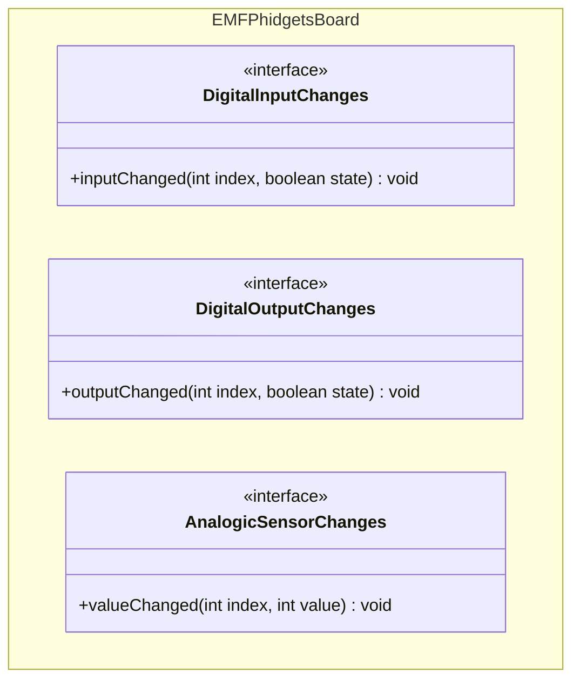

# EMFPhidgetBoard
  

### Exemple pour avancés
L'EMFPhidgetBoard peut également être utilisé dans un mode `"asynchrone"`. Dans ce mode très intéressant, plutôt que de devoir régulièrement vérifier soi-même si un bouton est pressé ou non, on sera spontanément appelé lorsque l'état de celui-ci change. Pour être plus clair, c'est un bout de code que l'on fourni qui sera appelé. On appelle ça `la programmation événementielle`.

Ce mode nécessite de comprendre la notion d'interfaces, qui est au programme dès la 2ème année.

Mais ce n'est pas si compliqué que cela. Jugez par vous-même. Le code Java ci-dessous réalise la consigne suivante.

#### Consigne

Pour fonctionner, ce programme prévoit que les phidgets suivants soient connectés :
- 1x [capteur phidget de temperature 1125_0](https://www.phidgets.com/?prodid=96) doit être branché sur le port phidget N°6
- 1x [capteur phidget d'humidité 1125_0](https://www.phidgets.com/?prodid=96) doit être branché sur le port phidget N°4

Ce programme Java commence par se connecter à l’EMFPhidgetBoard. Une fois la connection établie, il affiche la température actuelle en [°C] et l'humidité actuelle en [%] prise sur les phidgets branchés sur les ports N°4 et N°6. Ensuite et tant que le bouton N°7 ne sera pas pressé, le programme dormira répétitivement 50[ms]. Dès que le bouton N°7 sera pressé, le programme se déconnecte de l’EMFPhidgetBoard et se terminera.

De plus et durant tout ce laps de temps, de manière événementielle :
- Grâce à la méthode `setDigitalInputChangesListener()` qui permet d'enregistrer un bout de code à appeler en cas de changement de l'une ou l'autre des entrées digitales (=les boutons), à chaque fois qu'un bouton sera pressé ou relaché, le bout de code enregistré sera appelé ([voir code Java ci-dessous](#code-java-correspondant)).
- Grâce à la méthode `setDigitalOutputChangesListener()` qui permet d'enregistrer un bout de code à appeler en cas de changement de l'une ou l'autre des sorties digitales (=les leds), à chaque fois qu'une led sera allumée ou éteinte, le bout de code enregistré sera appelé ([voir code Java ci-dessous](#code-java-correspondant)).
- Grâce à la méthode `setAnalogicSensorChangesListener()` qui permet d'enregistrer un bout de code à appeler en cas de changement de l'une ou l'autre des entrées/sorties analogiques (=les phidgets branchés), à chaque fois qu'un phidget verra sa valeur changer, le bout de code enregistré sera appelé ([voir code Java ci-dessous](#code-java-correspondant)).


#### Structogramme correspondant


#### Diagramme des classes UML
On peut constater que la classe `Board` mets également à disposition les 8x capteurs phidget branchés, soit directement (via les attributs `capteur0` à `capteur7`) ou indirectement (via l'attribut tableau `capteurs`).

Et on retrouve ces 3 méthodes spéciales qui permettent de s'abonner aux événements concernés :
- `setDigitalInputChangesListener()` pour les changements de l'une ou l'autre des entrées digitales (=les boutons)
- `setDigitalOutputChangesListener()` pour les changement de l'une ou l'autre des sorties digitales (=les leds)
- `setAnalogicSensorChangesListener()` pour les changements de l'une ou l'autre des entrées/sorties analogiques (=les phidgets branchés)


Et voici ci-dessous les 3 événements (interfaces) auxquels on peut s'abonner via ces 3 méthodes spéciales (`setDigitalInputChangesListener()`, `setDigitalOutputChangesListener()` et `setAnalogicSensorChangesListener()`).

Pour être notifié de ces événements, il va falloir implémenter les méthodes ci-dessous, visibles dans ces interfaces :  


#### Code Java correspondant
```java
import EMFPhidgetsBoard.Board;

/**
 * Application "EMFPhidgetsBoardExAdvanced".
 *
 * Application de base pour que l'élève puisse s'éclater un peu :-)
 *
 * @author <a href="mailto:paul.friedli@edufr.ch">Paul Friedli</a>
 * @since 13 août 2013
 * @version 0.1
 */
public class EMFPhidgetsBoardExAdvanced {

    public static void main(String[] args) {

        // Création de l'objet EMFPhidgetsBoard pour converser avec l'EMFPhidgetBoard
        final Board board = new EMFPhidgetsBoard.Board();

        // Installer les listeners pour afficher les changements d'état à la volée
        board.setAnalogicSensorChangesListener((index, valeur) -> {
            System.out.println("Le phidget N°" + index + " à une valeur de " + valeur);
        });

        board.setDigitalInputChangesListener((index, etat) -> {
            System.out.println("L'entrée N°" + index + " est à " + etat);
            board.leds[index].setEtat(etat);
        });

        board.setDigitalOutputChangesListener((index, etat) -> {
            System.out.println("La sortie N°" + index + " est à " + etat);
        });

        // Se connecter à l'EMFPhidgetBoard
        if (board.seConnecter()) {
            // Afficher la température et l'humidité
            System.out.println("-----------------------------------------------------");
            System.out.println(
                    "La température actuelle est de : " + calculerTemperature(board.capteur6.getValeur()) + "°C");
            System.out.println("L'humidité actuelle est de : " + calculerHumidite(board.capteur4.getValeur()) + "%");
            System.out.println("-----------------------------------------------------");

            // Tant qu'on ne presse pas le bouton N°7, on continue... de dormir...
            do {
                board.dormir(50);
            } while (!board.bouton7.estPresse());

            // Se déconnecter du contrôleur
            board.seDeconnecter();
        }
    }

    public static double calculerTemperature(int phidgetValue) {
        // Cette formule de conversion est fournie avec le capteur de température
        return (int) (((phidgetValue * 0.22222) - 61.11) * 100.0) / 100.0;
    }

    public static double calculerHumidite(int phidgetValue) {
        // Cette formule de conversion est fournie avec le capteur d'humidité
        return (int) (((phidgetValue * 0.1906) - 40.2) * 100.0) / 100.0;
    }
}

```


[Revenir à la consigne principale README.md](/README.md)
