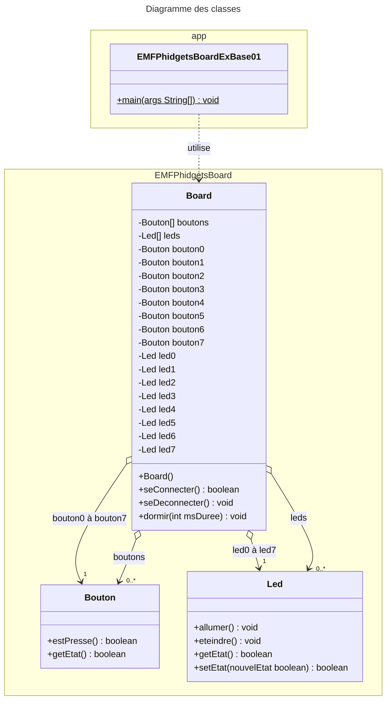

# EMFPhidgetBoard
  

[Revenir à la consigne principale README.md](/README.md)

### Exemple 01 – Allumer les leds
#### Consigne
Votre programme doit allumer toutes les leds de l’EMFPhidgetBoard si le bouton 4 est pressé, toutes les éteindre toutes s’il n’est pas pressé et le programme devra quitter lorsqu’on pressera le bouton 7.
#### Structogramme correspondant


#### Diagramme des classes UML

Comme le montre le diagramme des classes ci-dessus, la classe `Board` est très simple et ne permet de faire que 3 choses :
- vous connecter à l'EMFPhidgetBoard afin de pouvoir l'utiliser, et ce à l'aide de sa méthode `seConnecter()`
- vous déconnecter de l'EMFPhidgetBoard une fois terminé, à l'aide de sa méthode `seDeconnecter()`
- dormir durant un nombre défini de millisecondes, à l'aide de sa méthode `dormir(int msDuree)`

Une fois connecté à l'EMFPhidgetBoard, un objet issu de la classe `Board` vous mettra directement à disposition ses boutons et ses leds :
- sous forme d'attributs spécifiques pour un accès direct (`led0` à `led7` et `bouton0` à `bouton7`)  
_par exemple l'attribut `led3` pour pouvoir allumer ou eteindre la led N°4 ou l'attribut `bouton2` pour pouvoir interroger le bouton N°3 afin de savoir s'il est pressé ou non_
- sous forme de tableau d'objets pour y accéder indirectement  
_par exemple `boutons[2]` pour atteindre le 3ème bouton_

Les fonctionnalités des classes `Bouton` et `Led` sont très simples et y sont également visibles :
- Pour un `Bouton` on peut seulement lui demander s'il est pressé ou non.
- Pour une `Led` on peut lui demander si elle est allumée ou non, ainsi que l'allumer et l'éteindre.

#### Code Java correspondant
```java
import EMFPhidgetsBoard.Board;

/**
 * Application "EMFPhidgetsBoardExBase01".
 *
 * @author <a href="mailto:paul.friedli@edufr.ch">Paul Friedli</a>
 * @since 04 novembre 2014
 * @version 0.1
 */
public class EMFPhidgetsBoardExBase01 {

    public static void main( String[] args ) {

        // Création de l'objet Board permettant de communiquer simplement avec l'EMFPhidgetBoard
        Board board = new Board();

        // Tenter de se connecter au board..
        if ( board.seConnecter() ) {
            // On est bien connectés
            System.out.println( "Nous sommes CONNECTÉS au EMFPhidgetBoard !" );

            // Continuer tant qu'on ne presse pas le bouton N°7
            while (!board.bouton7.estPresse()) {

                // Faut-il allumer ou éteindre les leds ?
                boolean allumer = board.bouton4.estPresse();

                // Allumer ou éteindre les leds
                board.led0.setEtat( allumer );
                board.led1.setEtat( allumer );
                board.led2.setEtat( allumer );
                board.led3.setEtat( allumer );
                board.led4.setEtat( allumer );
                board.led5.setEtat( allumer );
                board.led6.setEtat( allumer );
                board.led7.setEtat( allumer );
                
                // Dormir un peu pour pas aller trop vite (ici 20x par seconde on va vérifier)
                board.dormir( 50 );
            }

            // Se déconnecter proprement du board
            board.seDeconnecter();

            // Notifier l'utilisateur
            System.out.println( "Nous sommes DÉCONNECTÉS de l'EMFPhidgetBoard !" );
        } else {
            // Indiquer le problème à l'utilisateur
            System.out.println( "Erreur : pas connecté au EMFPhidgetBoard !" );
        }
    }
}
```


[Revenir à la consigne principale README.md](/README.md)
