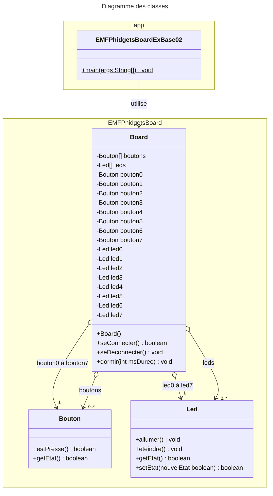

# EMFPhidgetBoard
  

[Revenir à la consigne principale README.md](/README.md)

### Exemple 02 – La valeur du byte
#### Consigne
Votre programme doit allumer ou éteindre chaque led de l’EMFPhidgetBoard en fonction de l’état du bouton de même numéro.

De plus, on va calculer la valeur du byte qui aurait les mêmes bits à 1 que les leds allumées.

Affichez le nombre décimal qui correspond à cette série de bits composant ce byte.

Le bouton 7 doit permettre de quitter le programme à tout moment.
#### Structogramme correspondant


#### Diagramme des classes UML

Comme le montre le diagramme des classes ci-dessus, la classe `Board` est très simple et ne permet de faire que 3 choses :
- vous connecter à l'EMFPhidgetBoard afin de pouvoir l'utiliser, et ce à l'aide de sa méthode `seConnecter()`
- vous déconnecter de l'EMFPhidgetBoard une fois terminé, à l'aide de sa méthode `seDeconnecter()`
- dormir durant un nombre défini de millisecondes, à l'aide de sa méthode `dormir(int msDuree)`

Une fois connecté à l'EMFPhidgetBoard, un objet issu de la classe `Board` vous mettra directement à disposition ses boutons et ses leds :
- sous forme d'attributs spécifiques pour un accès direct (`led0` à `led7` et `bouton0` à `bouton7`)  
_par exemple l'attribut `led3` pour pouvoir allumer ou eteindre la led N°4 ou l'attribut `bouton2` pour pouvoir interroger le bouton N°3 afin de savoir s'il est pressé ou non_
- sous forme de tableau d'objets pour y accéder indirectement  
_par exemple `boutons[2]` pour atteindre le 3ème bouton_

Les fonctionnalités des classes `Bouton` et `Led` sont très simples et y sont également visibles :
- Pour un `Bouton` on peut seulement lui demander s'il est pressé ou non.
- Pour une `Led` on peut lui demander si elle est allumée ou non, ainsi que l'allumer et l'éteindre.

#### Code Java correspondant
```java

import EMFPhidgetsBoard.Board;

/**
 * Application "EMFPhidgetsBoardExBase02".
 *
 * @author <a href="mailto:paul.friedli@edufr.ch">Paul Friedli</a>
 * @since 04 novembre 2014
 * @version 0.1
 */
public class EMFPhidgetsBoardExBase02 {

    public static void main( String[] args ) {

        // Création de l'objet Board permettant de communiquer simplement avec l'EMFPhidgetBoard
        Board board = new Board();

        // Tenter de se connecter au board..
        if ( board.seConnecter() ) {
            // On est bien connectés
            System.out.println( "Nous sommes CONNECTÉS au EMFPhidgetBoard !" );

            // Continuer tant qu'on ne presse pas le bouton N°7
            while ( !board.bouton7.estPresse() ) {

                // Allumer ou éteindre les leds
                board.led0.setEtat( board.bouton0.getEtat() );
                board.led1.setEtat( board.bouton1.getEtat() );
                board.led2.setEtat( board.bouton2.getEtat() );
                board.led3.setEtat( board.bouton3.getEtat() );
                board.led4.setEtat( board.bouton4.getEtat() );
                board.led5.setEtat( board.bouton5.getEtat() );
                board.led6.setEtat( board.bouton6.getEtat() );
                board.led7.setEtat( board.bouton7.getEtat() );

                // Composer une valeur BYTE avec chacun des bits des leds
                int valeur = 0;
                if ( board.led0.getEtat() ) {
                    valeur += 1;
                }
                if ( board.led1.getEtat() ) {
                    valeur += 2;
                }
                if ( board.led2.getEtat() ) {
                    valeur += 4;
                }
                if ( board.led3.getEtat() ) {
                    valeur += 8;
                }
                if ( board.led4.getEtat() ) {
                    valeur += 16;
                }
                if ( board.led5.getEtat() ) {
                    valeur += 32;
                }
                if ( board.led6.getEtat() ) {
                    valeur += 64;
                }
                if ( board.led7.getEtat() ) {
                    valeur += 128;
                }

                // Afficher la valeur
                System.out.println( "La valeur correspondante du byte est : " + valeur );

                // Dormir un peu pour pas aller trop vite (ici 20x par seconde on va vérifier)
                board.dormir( 50 );
            }

            // Se déconnecter proprement du board
            board.seDeconnecter();

            // Notifier l'utilisateur
            System.out.println( "Nous sommes DÉCONNECTÉS de l'EMFPhidgetBoard !" );
        } else {
            // Indiquer le problème à l'utilisateur
            System.out.println( "Erreur : pas connecté au EMFPhidgetBoard !" );
        }
    }
}
```

[Revenir à la consigne principale README.md](/README.md)
