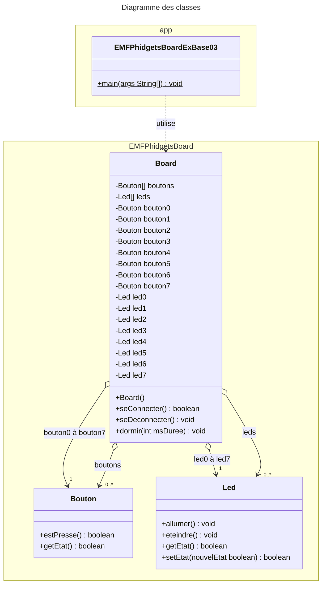

# EMFPhidgetBoard
  

[Revenir à la consigne principale README.md](/README.md)

### Exemple 03 – Le chenillard
  

#### Consigne
Votre programme doit réaliser un chenillard. En clair, tour à tour chacune des led va s’allumer, puis s’éteindre, puis c’est la suivante qui s’allume puis s’éteint, etc. Et lorsqu’on arrive à la dernière led on recommence avec la première. On aura ainsi une impression visuelle d'une chenille qui se déplace rapidement.

Vos leds doivent rester allumées durant 100ms au moins et votre programme devra quitter lorsqu’on pressera en même temps les boutons 4 et 7. 

Une fois que votre programme fonctionnera, rajoutez la fonctionnalité suivante pour changer la vitesse de déplacement de la lumière :
- une pression sur le bouton 5 va diminuer le temps d’attente (jusqu’à un minimum de 10ms)
- une pression sur le bouton 6 va augmenter le temps d’attente (jusqu’à un minimum de 500ms)

**Question :** Que devrait-on changer pour que la chenille rebondisse aux extrêmités ?

#### Structogramme correspondant


#### Diagramme des classes UML

Comme le montre le diagramme des classes ci-dessus, la classe `Board` est très simple et ne permet de faire que 3 choses :
- vous connecter à l'EMFPhidgetBoard afin de pouvoir l'utiliser, et ce à l'aide de sa méthode `seConnecter()`
- vous déconnecter de l'EMFPhidgetBoard une fois terminé, à l'aide de sa méthode `seDeconnecter()`
- dormir durant un nombre défini de millisecondes, à l'aide de sa méthode `dormir(int msDuree)`

Une fois connecté à l'EMFPhidgetBoard, un objet issu de la classe `Board` vous mettra directement à disposition ses boutons et ses leds :
- sous forme d'attributs spécifiques pour un accès direct (`led0` à `led7` et `bouton0` à `bouton7`)  
_par exemple l'attribut `led3` pour pouvoir allumer ou eteindre la led N°4 ou l'attribut `bouton2` pour pouvoir interroger le bouton N°3 afin de savoir s'il est pressé ou non_
- sous forme de tableau d'objets pour y accéder indirectement  
_par exemple `boutons[2]` pour atteindre le 3ème bouton_

Les fonctionnalités des classes `Bouton` et `Led` sont très simples et y sont également visibles :
- Pour un `Bouton` on peut seulement lui demander s'il est pressé ou non.
- Pour une `Led` on peut lui demander si elle est allumée ou non, ainsi que l'allumer et l'éteindre.

#### Code Java correspondant
```java

import EMFPhidgetsBoard.Board;

/**
 * Application "EMFPhidgetsBoardExBase03".
 *
 * @author <a href="mailto:paul.friedli@edufr.ch">Paul Friedli</a>
 * @since 04 novembre 2014
 * @version 0.1
 */
public class EMFPhidgetsBoardExBase03 {

    public final static int VITESSE_INITIALE = 100;     // On dort 100ms donc 10x par seconde
    public final static int VITESSE_MIN = 500;          // On dort 500ms donc 2x par seconde
    public final static int VITESSE_MAX = 10;           // On ne dort que 10ms donc 100x par seconde
    public final static int VITESSE_INCREMENT = 10;     // Accélération ou décélération
    
    public static void main( String[] args ) {

        // Création de l'objet Board permettant de communiquer simplement avec l'EMFPhidgetBoard
        Board board = new Board();

        // Tenter de se connecter au board..
        if ( board.seConnecter() ) {
            
            // L'indice de la lumière allumée de notre "chenillard"..
            int positionAllumee = 0;

            // Histoire de les voir bouger, on ne fait que 10 animations par seconde (au début en tout cas)...
            int msDormir = VITESSE_INITIALE;
            
            // Ce programme ne s'arrêtera jamais, sauf si on presse les boutons 4 et 7 en même temps            
            while ( !( board.bouton4.estPresse() && board.bouton7.estPresse() ) ) {

                // Allumer chaque led selon la position courante du chenillard
                for ( int i = 0; i < board.leds.length; i++ ) {
                    board.leds[i].setEtat( positionAllumee == i );
                }

                // Implémenter la rotation de lumières du chenillard... on prend simplement la suivante !
                positionAllumee = ( positionAllumee + 1 ) % board.leds.length;    // Mieux encore

                // Histoire de le voir bouger, on ne fait que 20 animations par seconde
                board.dormir( msDormir );

                // Plus vite ?
                if ( board.bouton6.estPresse() ) {
                    msDormir = Math.max( VITESSE_MAX, msDormir - VITESSE_INCREMENT );
                    // Attendre que le bouton soit relaché.. (=> 1 pression à la fois ;-)
                    while ( board.bouton6.estPresse() ) {
                        board.dormir( msDormir );
                    }
                    System.out.println( "Vitesse : " + ( 1000 / msDormir ) + " fois par seconde" );
                }
                // Moins vite ?
                if ( board.bouton5.estPresse() ) {
                    msDormir = Math.min( VITESSE_MIN, msDormir + VITESSE_INCREMENT );
                    // Attendre que le bouton soit relaché.. (=> 1 pression à la fois ;-)
                    while ( board.bouton5.estPresse() ) {
                        board.dormir( msDormir );
                    }
                    System.out.println( "Vitesse : " + ( 1000 / msDormir ) + " fois par seconde" );
                }
            }

            // Ne laisser aucune led allumée avant de quitter le programme
            for ( int i = 0; i < board.leds.length; i++ ) {
                board.leds[i].setEtat( false );
            }

            // On se déconnecte du board
            board.seDeconnecter();
        }
    }
}
```

[Revenir à la consigne principale README.md](/README.md)
