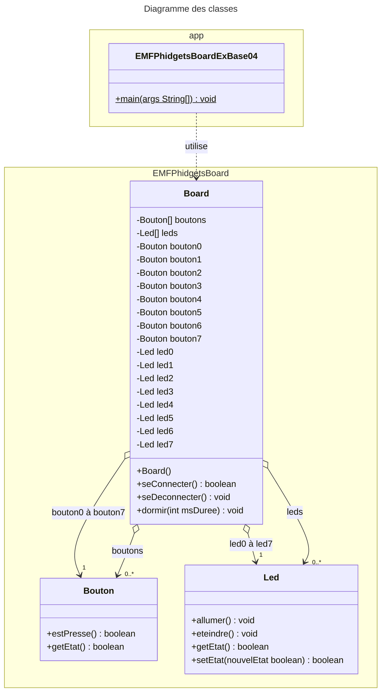

# EMFPhidgetBoard
  

[Revenir à la consigne principale README.md](/README.md)

### Exemple 04 – Devine ton nombre

#### Consigne
Vous allez réaliser le jeu « deviner mon nombre » mais inversé cette fois-ci.

En clair c’est vous qui allez penser à un nombre et c’est l’ordinateur qui devra le deviner en vous faisant progressivement des propositions.

Vous lui répondrez à l’aide :
- du bouton N°4 si son nombre proposé est trop petit
- du bouton N°6 si son nombre proposé est trop grand
- du bouton N°5 si l'ordinateur a deviné votre nombre !

#### Structogramme correspondant


#### Diagramme des classes UML

Comme le montre le diagramme des classes ci-dessus, la classe `Board` est très simple et ne permet de faire que 3 choses :
- vous connecter à l'EMFPhidgetBoard afin de pouvoir l'utiliser, et ce à l'aide de sa méthode `seConnecter()`
- vous déconnecter de l'EMFPhidgetBoard une fois terminé, à l'aide de sa méthode `seDeconnecter()`
- dormir durant un nombre défini de millisecondes, à l'aide de sa méthode `dormir(int msDuree)`

Une fois connecté à l'EMFPhidgetBoard, un objet issu de la classe `Board` vous mettra directement à disposition ses boutons et ses leds :
- sous forme d'attributs spécifiques pour un accès direct (`led0` à `led7` et `bouton0` à `bouton7`)  
_par exemple l'attribut `led3` pour pouvoir allumer ou eteindre la led N°4 ou l'attribut `bouton2` pour pouvoir interroger le bouton N°3 afin de savoir s'il est pressé ou non_
- sous forme de tableau d'objets pour y accéder indirectement  
_par exemple `boutons[2]` pour atteindre le 3ème bouton_

Les fonctionnalités des classes `Bouton` et `Led` sont très simples et y sont également visibles :
- Pour un `Bouton` on peut seulement lui demander s'il est pressé ou non.
- Pour une `Led` on peut lui demander si elle est allumée ou non, ainsi que l'allumer et l'éteindre.

#### Code Java correspondant
```java
import EMFPhidgetsBoard.Board;

/**
 * Application "EMFPhidgetsBoardExBase04".
 *
 * @author <a href="mailto:paul.friedli@edufr.ch">Paul Friedli</a>
 * @since 04 novembre 2014
 * @version 0.1
 */
public class EMFPhidgetsBoardExBase04 {

    public final static int MAX_NUMBER = 100;   // Le plus grand nombre du jeu
    public final static int MIN_NUMBER = 1;     // Le plus petit nombre du jeu

    public static void main( String[] args ) {

        // Création de l'objet Board permettant de communiquer simplement avec l'EMFPhidgetBoard
        Board board = new Board();

        // Tenter de se connecter au board..
        if ( board.seConnecter() ) {

            // Indiquer au joueur qu'il doit penser à un nombre
            System.out.println( "Veuillez penser à un nombre de " + MIN_NUMBER + " à " + MAX_NUMBER + " !" );

            // Proposition et limites au départ
            int currentMin = MIN_NUMBER - 1;
            int currentMax = MAX_NUMBER + 1;
            int proposition = ( currentMax - currentMin ) / 2 + currentMin;

            // Continuer tant qu'on ne presse pas le bouton N°5 (nombre trouvé)
            while ( !board.bouton5.estPresse() ) {

                // Afficher la proposition
                System.out.println( "Je pense que c'est le nombre " + proposition );

                // Attendre que l'un des boutons 4, 5, 6 ou 7 soit pressé
                while ( !( board.bouton4.estPresse() || board.bouton5.estPresse() || board.bouton6.estPresse() ) ) {
                    // Dormir un peu pour pas aller trop vite (ici 20x par seconde on va vérifier)
                    board.dormir( 50 );
                }

                // Si le bouton 4 est pressé, c'est que c'est trop petit !
                if ( board.bouton4.estPresse() ) {
                    // La valeur courante devient le minimum
                    currentMin = proposition;
                    // On avance de la moitié de la distance avec la valeur MAX_NUMBER
                    proposition = proposition + ( currentMax - proposition ) / 2;
                } else if ( board.bouton6.estPresse() ) {
                    // La valeur courante devient le maximum
                    currentMax = proposition;
                    // On recule de la moitié de la distance avec la valeur MIN_NUMBER
                    proposition = proposition - ( proposition - currentMin ) / 2;
                }

                // Attendre que les boutons 4, 5, 6 ou 7 soient tous relâchés
                while ( board.bouton4.estPresse() || board.bouton6.estPresse() ) {
                    // Dormir un peu pour pas aller trop vite (ici 20x par seconde on va vérifier)
                    board.dormir( 50 );
                }
            }

            // Indiquer la réussite
            System.out.println( "Merci d'avoir joué avec moi, c'était trop facile de trouver votre nombre :-)" );

            // Se déconnecter proprement du board
            board.seDeconnecter();
        }
    }
}
```

[Revenir à la consigne principale README.md](/README.md)
