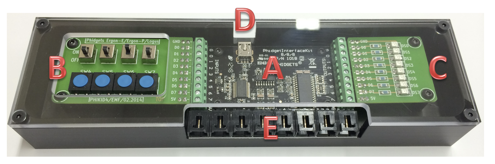

# EMFPhidgetBoard
  

## A lire avant toute chose 
Lisez avec grande attention TOUTES les informations fournies ci-dessous avant de tenter d'utiliser ce matériel !

## Table des matières
1. [C'est quoi un EMFPhidgetBoard ?](#cest-quoi-un-emfphidgetboard-)
    1. [Installation et raccordement](#installation-et-raccordement)
    1. [Driver phidgets et control panel](#driver-phidgets-et-control-panel)
    1. [Warning fragilité](#warning-fragilité)
    1. [Vérifier que tout fonctionne](#vérifier-que-tout-fonctionne)
1. [Exemples de prise en mains](#exemples-de-prise-en-mains)
    1. [Comment tester, comment faire fonctionner ces exemples fournis ?](#comment-tester-comment-faire-fonctionner-ces-exemples-fournis-)
    1. [Exemple 01 – Allumer les leds](#exemple-01--allumer-les-leds)
    1. [Exemple 02 – La valeur du byte](#exemple-02--la-valeur-du-byte)
    1. [Exemple 03 – Le chenillard](#exemple-03--le-chenillard)
    1. [Exemple 04 – Devine ton nombre](#exemple-04--devine-ton-nombre)
    1. [Exemple pour avancés](#exemple-pour-avancés)
1. [Votre projet personnel](#votre-projet-personnel)
    1. [Liste des capteurs à disposition](#liste-des-capteurs-à-disposition)
    1. [Réalisez votre projet](#réalisez-votre-projet)
1. [Dernier point indispensable : se féliciter du chemin accompli !](#dernier-point-indispensable--se-féliciter-du-chemin-accompli-)

## C'est quoi un EMFPhidgetBoard ?
Ce boîtier didactique réalisé à l’EMF est né en 2013 de l’idée de [votre serviteur](https://github.com/paul-friedli) de créer un support d'apprentissage simple permettant de rendre l’**apprentissage de la programmation plus convivial** et bien **plus sympathique** à ses débuts.

Buts : continuer de **développer les aptitudes de base** et l’aisance en programmation en utilisant des composants avec lesquels on peut physiquement interagir.  
  
Au niveau matériel ce boîtier fabriqué à l'EMF intègre [un contrôleur phidget 1018](https://www.phidgets.com/?prodid=1198) **(A)** sur lequel sont raccordée deux circuits réalisés à l’EMF : le circuit **(B)** à gauche comportant huit boutons et le circuit **(C)** à droite comportant huit leds.

Le boîtier se connecte et s'alimente par une connexion USB **(D)** vers l'ordinateur. Si souhaité, les ports phidgets **(E)** numérotés de 0 à 7 peuvent également être utilisés pour piloter divers capteurs comme [des sliders](https://www.phidgets.com/?prodid=83), [des joysticks](https://www.phidgets.com/?prodid=84), des [capteurs de température](https://www.phidgets.com/?prodid=95), ...

Au niveau logiciel, [une librairie Java spécifique](/lib/EMFPhidgetsBoardLib.jar) rend l’utilisation de ce support didactique vraiment très simple et intuitive. Et des projets Java très simples de prise en mains viennent compléter ce dispositif d'apprentissage.

## Installation et raccordement
### Driver phidgets et control panel
Pour pouvoir utiliser des phidgets il va falloir installer le logiciel système nécessaire sur votre poste de travail (uniquement si cela n'a pas déjà été fait).

Ce logiciel système comprends un driver matériel USB, la bibliothèque native, la librairie Java faisant le pont vers cette bibliothèque native ainsi qu'un control panel très pratique.

Vous trouverez ici les programmes d'installation nécessaires : [https://www.phidgets.com/docs/Operating_System_Support](https://www.phidgets.com/docs/Operating_System_Support)
### Warning fragilité
**ATTENTION** : ces prises USB sont très fragiles ! Prenez grand soin de ne jamais les forcer et de toujours tirer/pousser la prise bien droit sans jamais la mailler ou la tordre pour la sortir,
sous peine de décoller ou rompre les soudures de la prise USB de son circuit et/ou générer de mauvais contacts.

Idem avec les câbles phidgets lorqu'on souhaite les débrancher des ports **(E)** ou d'un capteur phidget : ne jamais tirer sur ces câbles mais bien sur les prises noires en veillant à bien presser le loquet, car sinon les câbles seront arrachés et vous resterons en mains.

### Vérifier que tout fonctionne
Après avoir [installé le driver phidget](#driver-phidgets-et-control-panel), démarrez le "control panel" phidget sur votre ordinateur.  

Vous devriez voir apparaître quelque-chose de ce genre :  

Branchez **seulement ensuite** l'EMFPhidgetBoard à votre PC à l'aide du câble USB fourni. Vous devriez voir apparaître une nouvelle ligne nommée "PhidgetInterfaceKit 8/8/8" dans le control panel, comme ci-dessous :  

Si c'est le cas, tout est en ordre et vous allez pouvoir passer à la suite :-).  
Dans le cas contraire, inutile de tenter de continuer : cela ne fonctionnera pas. Il vous faudra d'abord résoudre ce problème.

# Exemples de prise en mains

Le moment est venu de tester les 4 petits exemples simples dont le code Java est fourni. 

Ces exemples vous permettront de découvrir le fonctionnement de ce boîtier EMFPhidgetBoard, de découvrir ses possibilités et de bien comprendre son fonctionnement en Java.

BUT : être ensuite en mesure de réaliser votre propre projet ludique.

**Prenez le temps de bien les comprendre**, d'inspecter le code fourni, de le faire fonctionner pas par pas avec le débogueur afin de vous assurer de bien comprendre chacune de ses lignes de code et ce **AVANT** de passer à votre propre réalisation.

## Comment tester, comment faire fonctionner ces exemples fournis ?
Après avoir cloné en local ce projet dans Visual Studio Code, il vous faut simplement sélectionner le programme désiré dans la partie gauche afin que celui-ci s'affiche dans l'éditeur (ils se trouvent tous dans le dossier `src`). Par exemple `/src/EMFPhidgetsBoardExBase01.java`.

Ensuite, Visual Studio Code va comprendre qu'il s'agit d'un programme Java, va s'initialiser correctement et, une fois qu'il aura fini de se préparer à utiliser Java, vous pourrez cliquer sur l'icône "triangle" pour le directement le démarrer. Rien de plus simple !

## Exemple 01 – Allumer les leds
Allumer toutes les leds sur l'EMFPhidgetBoard en fonction d'un bouton pressé ou non.

[&rarr; Cliquez ici pour afficher cette consigne et ce code d'exemple afin de le tester](EMFPhidgetsBoardExBase01.md)

## Exemple 02 – La valeur du byte
Allumer les leds sur l'EMFPhidgetBoard qui correspondent aux boutons pressés et afficher le nombre décimal équivalent.

[&rarr; Cliquez ici pour afficher cette consigne et ce code d'exemple afin de le tester](EMFPhidgetsBoardExBase02.md)

## Exemple 03 – Le chenillard
Produire une animation visuelle en allumant et éteignant les leds les unes après les autres dans un ordre défini, à une certaine fréquence.

[&rarr; Cliquez ici pour afficher cette consigne et ce code d'exemple afin de le tester](EMFPhidgetsBoardExBase03.md)

## Exemple 04 – Devine ton nombre
Une variation du jeu "Devine le nombre auquel j'ai pensé" : c'est l'ordinateur qui va tenter de deviner le nombre auquel vous aurez pensé :-)

[&rarr; Cliquez ici pour afficher cette consigne et ce code d'exemple afin de le tester](EMFPhidgetsBoardExBase04.md)

## Exemple pour avancés
L'EMFPhidgetBoard peut également être utilisé dans un mode `"asynchrone"`, qu'on appelle plus communément `programmation "événementielle"`.

Dans ce mode très intéressant, ce n'est pas vous qui allez régulièrement vérifier si un bouton est pressé ou non, mais ce sera un bout de code que vous fournirez qui sera spontanément appelé lorsque le bouton sera pressé ou relaché. C'est pas cool ça ? Et ça simplifie monstrueusement la programmation !

Vous découvrirez progressivement ces aspects dans vos futurs modules de programmation, mais ... pourquoi attendre quand c'est plutôt simple à prendre en mains ? Have fun !

[&rarr; Cliquez ici pour afficher cette consigne et ce code d'exemple afin de le tester](EMFPhidgetsBoardExAdvanced.md)

# Votre projet personnel

Enfin ! C'est la prochaine étape !!

Vous vous êtes imprégnés du fonctionnement de l'EMFPhidgetBoard et vous avez  bien compris son fonctionnement grâce aux 4 exemples fournis. Le temps est maintenant venu d'imaginer puis de **réaliser votre propre petit projet !**

## Liste des capteurs à disposition

Les caisses EMFPhidgetBoard contiennent du matériel didactique varié qui va vous permettre d'imaginer et réaliser un projet personnel sympathique et intéressant.

Voici la liste des phidgets disponibles pour votre projet :
| Phidget | Description | 
| :--- | :--- |
| [1112_1](https://www.phidgets.com/?tier=3&catid=15&pcid=13&prodid=83) | Slider 60 | 
| [1142_0](https://www.phidgets.com/?tier=3&catid=8&pcid=6&prodid=115) | Light Sensor 1000 lux | 
| [1124_0](https://www.phidgets.com/?tier=3&catid=14&pcid=12&prodid=95) | Precision Temperature Sensor | 
| [1113_0](https://www.phidgets.com/?tier=3&catid=15&pcid=13&prodid=84) | Mini Joy Stick Sensor | 
| [1103_1B](https://www.phidgets.com/?tier=3&catid=13&pcid=11&prodid=1047) | IR Reflective Sensor 10cm | 
| [1106_0](https://www.phidgets.com/?tier=3&catid=6&pcid=4&prodid=76) | Force Sensor (0-4kg) | 
| [1109_0](https://www.phidgets.com/?tier=3&catid=15&pcid=13&prodid=79) | Rotation Sensor | 
| [3003_0](https://www.phidgets.com/?tier=3&catid=30&pcid=26&prodid=153) | Phidget Cable 10cm (extra/spare) | 
| [3018_0](https://www.phidgets.com/?tier=3&catid=28&pcid=24&prodid=168) | Mini-USB Cable 180cm 24AWG | 
 
 Imaginez un projet simple ayant **un fonctionnement clair et précis**.

Adressez-vous ensuite à votre enseignant et expliquez-lui votre projet ainsi que vos besoins en matériel. Il vous fournira celui-ci en prêt.

## Réalisez votre projet
N'oubliez pas les fondamentaux appris :
- **Java n'est qu'un langage de programmation** (qui n'a que 53 mots-clés).  
&nbsp;  
_Donc si qqch vous semble difficile, c'est probablement que ce n'est pas encore suffisamment clair dans votre tête. Du papier/crayon : ça peut aider !  
Commencez donc par être au clair sur ce que vous voulez faire AVANT d'essayer de le faire ;-)_  
&nbsp;  
- **Mettez des points d'arrêt** aux endroits stratégiques et utilisez le débogueur :  
&nbsp;  
_Rien de tel que d'**inspecter vos variables** et de **regarder son propre code fonctionner** pour débusquer ces vilains petits bugs qui nous éloignent de cette extase finale lorsqu'on constate que notre programme fonctionne comme souhaité :-)_

# Dernier point indispensable : se féliciter du chemin accompli !
Votre programme fonctionne comme souhaité ?
**FÉLICITATIONS !**

Et n'oubliez pas :
- c'est bien le travail fourni (et non le résultat temporairement obtenu) qui vous auront beaucoup appris !
- c'est bien le chemin accompli qui vous auront apporté des enseignements (et non la destination atteinte qui elle apporte des émotions).

<mark>Pensez-y : si on ne se décourage pas et qu'on continue d'avancer, peu importe la distance qui reste à parcourir, on y arrivera !!! ;-)</mark>

**`Vive la programmation !`**

Et si tout fonctionne comme prévu ... quel plaisir, vous ressentirez une émotion dans ce genre-là :

| Bravo ! | Le travail paie ! | Félicitations ! |
| :---: | :---: | :---: |
|  |  |  |
|  |  |  |
